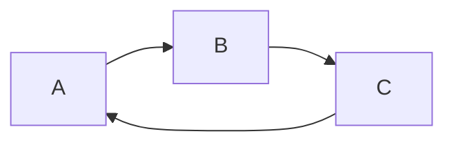
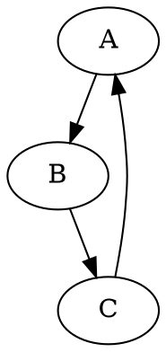

Format: 

```ruby
require 'redcarpet'
markdown = Redcarpet.new("Hello World!")
puts markdown.to_html
```
|a|b|
|--|--|
30^th^
H~2~O
Content [^1]

[^1]: Hi! This is a footnote

*[HTML]: Hyper Text Markup Language
*[W3C]:  World Wide Web Consortium
The HTML specification
is maintained by the W3C.

==marked==


[GitHub](http://github.com)


$$
S=\pi r^2
$$
$$ 
x = {-b \pm \sqrt{b^2-4ac} \over 2a}. 
$$
$$1=2-1$$
$S=\pi r^2$

```flow
   st=>start: 开始:>http://www.google.com[blank]
e=>end: 结束:>http://www.google.com[blank]
op1=>operation: My Operation
sub1=>subroutine: My Subroutine
cond=>condition: Yes
or No?:>http://www.google.com
io=>inputoutput: catch something...
para=>parallel: parallel tasks

st->op1->cond
cond(yes)->io->e
cond(no)->para
para(path1, bottom)->sub1(right)->op1
para(path2, top)->op1
```





[TOC]
#a
##b {ignore=true}
##c
#b
##d
###f

@import "test.json" {as="vega-lite"}
@import "git.pdf"
@import "test.png" {width="300px" height="200px" title="图片的标题" alt="我的 alt"}
@import "./docker.md"